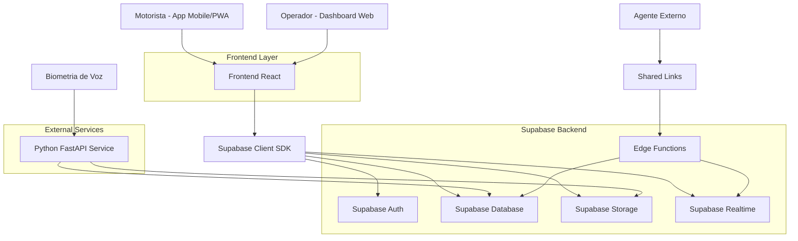
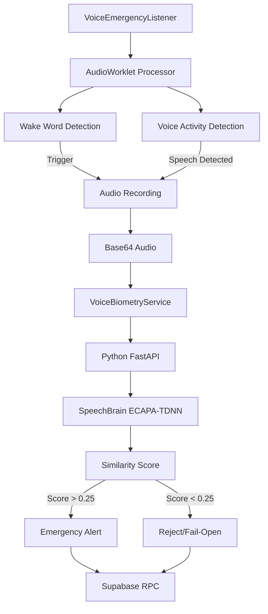
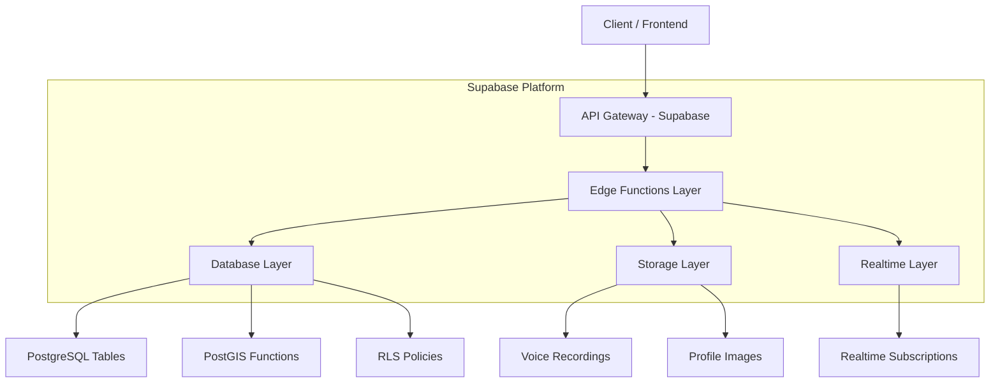
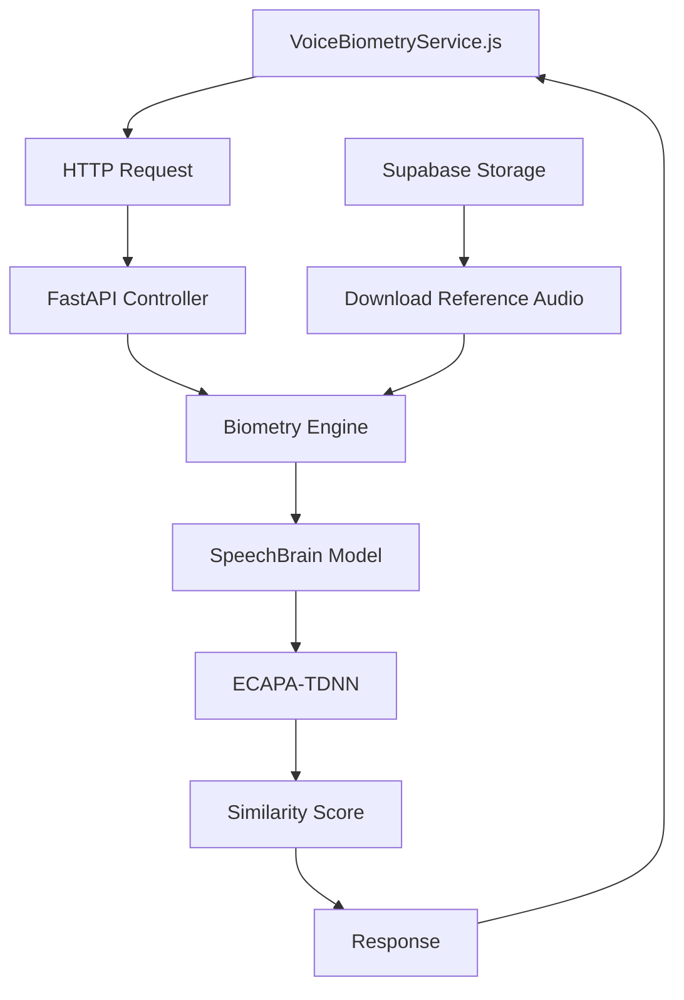
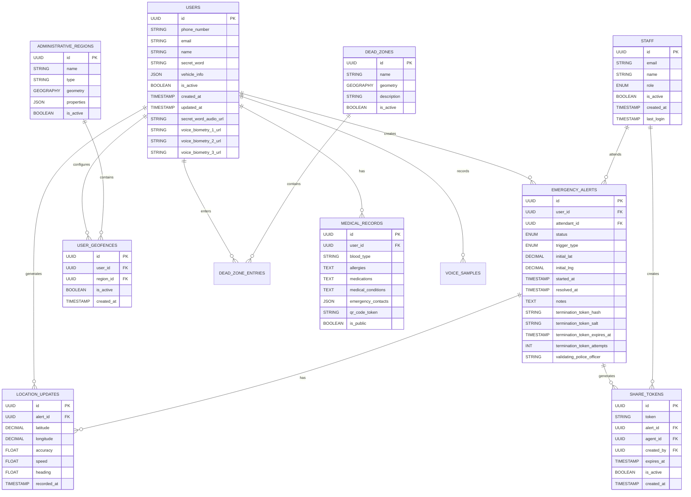

# SUSE-DF - Sistema Unificado de Segurança e Emergência
## Documento de Arquitetura Técnica

## 1. Arquitetura do Sistema

### 1.1 Diagrama Geral de Arquitetura



### 1.2 Diagrama de Arquitetura do Serviço de Biometria



## 2. Stack Tecnológica

### 2.1 Frontend
- **Framework:** React 18.2.0
- **Build Tool:** Vite 5.0.8
- **Estilização:** TailwindCSS 3.4.1
- **UI Components:** Lucide React (ícones)
- **Mapas:** Leaflet 1.9.4 + React-Leaflet 4.2.1
- **PWA:** Vite PWA Plugin + Workbox
- **Processamento de Áudio:** Meyda 5.6.3, ONNX Runtime Web 1.24.1
- **IA/ML:** TensorFlow.js 4.22.0, TensorFlow Speech Commands 0.5.4
- **QR Code:** qrcode.react 4.2.0, @yudiel/react-qr-scanner 1.2.10
- **Reconhecimento Facial:** face-api.js 0.22.2

### 2.2 Backend e Serviços
- **Backend Principal:** Supabase (BaaS)
- **Banco de Dados:** PostgreSQL com PostGIS
- **Autenticação:** Supabase Auth (JWT)
- **Storage:** Supabase Storage (buckets)
- **Realtime:** Supabase Realtime (WebSocket)
- **Edge Functions:** Deno/TypeScript
- **Serviço de Biometria:** Python FastAPI
- **IA de Voz:** SpeechBrain com modelo ECAPA-TDNN
- **Processamento de Áudio:** Librosa, SoundFile

### 2.3 Ferramentas de Desenvolvimento
- **Inicialização:** Vite-init
- **Linting:** ESLint com plugins React
- **Ambiente:** Node.js >=20.0.0

## 3. Definições de Rotas

### 3.1 Rotas do Dashboard Web (React Router)

| Rota | Página | Propósito |
|------|--------|-----------|
| `/` | Login | Página de autenticação para todos os usuários |
| `/admin/dashboard` | Dashboard Admin | Painel administrativo com estatísticas gerais |
| `/admin/users` | Gestão de Usuários | CRUD de usuários motoristas |
| `/admin/staff` | Gestão de Staff | CRUD de operadores e administradores |
| `/admin/audit` | Auditoria | Visualização de logs de sistema |
| `/operator/dashboard` | Dashboard Operador | Painel principal para operadores de mesa |
| `/operator/alerts/:id` | Detalhes do Alerta | Visualização completa de um alerta específico |
| `/supervisor/dashboard` | Dashboard Supervisor | Painel com funcionalidades administrativas |
| `/passenger/dashboard` | Dashboard Motorista | Interface principal do motorista (PWA) |
| `/passenger/profile` | Perfil Motorista | Configurações pessoais e do veículo |
| `/passenger/voice-config` | Configuração de Voz | Gravação e teste de biometria de voz |
| `/professional/dashboard` | Dashboard Profissional | Interface para profissionais de saúde |
| `/professional/qr-scanner` | Leitor QR | Scanner para acesso a dados médicos |
| `/public/shared/:token` | Alerta Compartilhado | Acesso externo a alertas via link |
| `/public/health/:token` | Acesso Saúde | Acesso emergencial a dados médicos |

### 3.2 Rotas da API (Supabase Edge Functions)

| Endpoint | Método | Descrição |
|----------|--------|-----------|
| `/functions/v1/trigger-emergency` | POST | Aciona alerta de emergência |
| `/functions/v1/verify-biometry` | POST | Verifica biometria de voz |

### 3.3 Rotas do Serviço Python (FastAPI)

| Endpoint | Método | Descrição |
|----------|--------|-----------|
| `/` | GET | Health check do serviço |
| `/verify` | POST | Verifica similaridade de voz com IA |

## 4. Definições de API

### 4.1 API de Emergência (Edge Function)

**Endpoint:** `POST /functions/v1/trigger-emergency`

**Request Body:**
```typescript
interface EmergencyTriggerRequest {
  trigger_type: 'voice' | 'button';
  latitude: number;
  longitude: number;
  notes?: string;
  audio_data?: string; // Base64 encoded audio
}
```

**Response:**
```typescript
interface EmergencyTriggerResponse {
  success: boolean;
  alert_id: string;
  status: 'active' | 'investigating' | 'resolved';
  created_at: string;
  message: string;
}
```

### 4.2 API de Biometria (Serviço Python)

**Endpoint:** `POST /verify`

**Request (Form Data):**
```typescript
interface BiometryVerifyRequest {
  user_id: string;
  audio_file: File; // Audio blob
  reference_type: 'secret_word' | 'biometry_phrase';
}
```

**Response:**
```typescript
interface BiometryVerifyResponse {
  verified: boolean;
  score: number;
  threshold: number;
  details: string;
}
```

### 4.3 API de Compartilhamento

**Endpoint:** `POST /functions/v1/generate-share-link`

**Request Body:**
```typescript
interface ShareLinkRequest {
  alert_id: string;
  agent_name: string;
  agent_phone: string;
  agent_organization: string;
}
```

**Response:**
```typescript
interface ShareLinkResponse {
  share_url: string;
  token: string;
  expires_at: string;
}
```

## 5. Arquitetura do Servidor

### 5.1 Diagrama de Camadas do Backend



### 5.2 Arquitetura do Serviço de Biometria



## 6. Modelo de Dados

### 6.1 Diagrama ER Principal



### 6.2 Definições de Tabelas SQL

#### Tabela de Usuários (users)
```sql
CREATE TABLE users (
    id UUID PRIMARY KEY DEFAULT gen_random_uuid(),
    phone_number VARCHAR(20) UNIQUE NOT NULL,
    email VARCHAR(255) UNIQUE,
    name VARCHAR(100) NOT NULL,
    secret_word VARCHAR(50) NOT NULL,
    vehicle_info JSONB,
    is_active BOOLEAN DEFAULT true,
    created_at TIMESTAMP WITH TIME ZONE DEFAULT NOW(),
    updated_at TIMESTAMP WITH TIME ZONE DEFAULT NOW(),
    secret_word_audio_url TEXT,
    voice_biometry_1_url TEXT,
    voice_biometry_2_url TEXT,
    voice_biometry_3_url TEXT,
    matricula VARCHAR(20)
);

CREATE INDEX idx_users_phone ON users(phone_number);
CREATE INDEX idx_users_active ON users(is_active);
```

#### Tabela de Alertas (emergency_alerts)
```sql
CREATE TABLE emergency_alerts (
    id UUID PRIMARY KEY DEFAULT gen_random_uuid(),
    user_id UUID REFERENCES users(id),
    attendant_id UUID REFERENCES staff(id),
    status VARCHAR(20) DEFAULT 'active' CHECK (status IN ('active', 'investigating', 'resolved', 'cancelled', 'waiting_police_validation')),
    trigger_type VARCHAR(20) CHECK (trigger_type IN ('voice', 'button', 'geofence_violation', 'dead_zone_entry')),
    initial_lat DECIMAL(10, 8) NOT NULL,
    initial_lng DECIMAL(11, 8) NOT NULL,
    started_at TIMESTAMP WITH TIME ZONE DEFAULT NOW(),
    resolved_at TIMESTAMP WITH TIME ZONE,
    notes TEXT,
    termination_token_hash TEXT,
    termination_token_salt TEXT,
    termination_token_expires_at TIMESTAMP WITH TIME ZONE,
    termination_token_attempts INT DEFAULT 0,
    validating_police_officer TEXT,
    created_at TIMESTAMP WITH TIME ZONE DEFAULT NOW()
);

CREATE INDEX idx_alerts_status ON emergency_alerts(status);
CREATE INDEX idx_alerts_user ON emergency_alerts(user_id);
CREATE INDEX idx_alerts_started ON emergency_alerts(started_at DESC);
```

#### Tabela de Auditoria (audit_logs)
```sql
CREATE TABLE audit_logs (
    id UUID PRIMARY KEY DEFAULT gen_random_uuid(),
    action TEXT NOT NULL,
    actor_id UUID REFERENCES auth.users(id),
    target_id UUID,
    metadata JSONB DEFAULT '{}'::jsonb,
    ip_address TEXT,
    created_at TIMESTAMPTZ DEFAULT NOW()
);

CREATE INDEX idx_audit_logs_action ON audit_logs(action);
CREATE INDEX idx_audit_logs_actor ON audit_logs(actor_id);
CREATE INDEX idx_audit_logs_target ON audit_logs(target_id);
CREATE INDEX idx_audit_logs_created_at ON audit_logs(created_at DESC);
```

### 6.3 Políticas de Segurança (RLS)

#### Políticas Básicas de Leitura
```sql
-- Motoristas veem apenas seus próprios dados
CREATE POLICY "Users view own data" ON users
    FOR SELECT USING (auth.uid() = id);

-- Staff vê todos os alertas
CREATE POLICY "Staff view all alerts" ON emergency_alerts
    FOR SELECT USING (
        EXISTS (
            SELECT 1 FROM staff 
            WHERE staff.email = (SELECT email FROM auth.users WHERE id = auth.uid())
        )
    );

-- Auditoria: Apenas administradores podem ver todos os logs
CREATE POLICY "Admin read audit" ON audit_logs
    FOR SELECT USING (
        EXISTS (
            SELECT 1 FROM staff 
            WHERE staff.email = (SELECT email FROM auth.users WHERE id = auth.uid()) 
            AND staff.role IN ('admin', 'master', 'supervisor')
        )
    );
```

#### Permissões de Modificação
```sql
-- Conceder permissões básicas para roles anon e authenticated
GRANT SELECT ON users TO anon;
GRANT ALL PRIVILEGES ON users TO authenticated;
GRANT SELECT ON emergency_alerts TO anon;
GRANT ALL PRIVILEGES ON emergency_alerts TO authenticated;
GRANT SELECT ON audit_logs TO authenticated;
GRANT INSERT ON audit_logs TO authenticated;
```

## 7. Configuração de Ambiente

### 7.1 Variáveis de Ambiente Frontend
```bash
# Arquivo .env.local
VITE_SUPABASE_URL=https://your-project.supabase.co
VITE_SUPABASE_ANON_KEY=your-anon-key
```

### 7.2 Variáveis de Ambiente Python Service
```bash
# Arquivo .env
SUPABASE_URL=https://your-project.supabase.co
SUPABASE_KEY=your-service-role-key
PORT=8000
```

### 7.3 Variáveis de Ambiente Edge Functions
```bash
# Configuradas no Supabase Dashboard
SUPABASE_URL=https://your-project.supabase.co
SUPABASE_ANON_KEY=your-anon-key
```

## 8. Scripts de Instalação e Configuração

### 8.1 Ordem de Execução dos Scripts SQL

Execute os scripts na seguinte ordem para configuração completa do banco de dados:

1. **Estrutura Base:** `backend/schema.sql`
2. **PostGIS:** `backend/setup_postgis_v2.sql`
3. **Auditoria:** `backend/setup_audit_governance_v2.sql`
4. **SIS_GEO:** `backend/sis_geo_full_setup.sql`
5. **Geocercas:** `backend/setup_geofencing_simple.sql`
6. **Zonas de Sombra:** `backend/setup_dead_zones.sql`
7. **Emergência:** `backend/rpc_trigger_emergency_v2.sql`
8. **Tokens:** `backend/implement_secure_token.sql`
9. **Configuração de Voz:** `backend/voice_config_setup.sql`
10. **Dados Iniciais:** `backend/seed_regions_v1.2.1.sql`
11. **Usuários Teste:** `backend/seed_test_users.sql`

### 8.2 Comandos de Deploy

#### Frontend (Vercel)
```bash
cd apps/web
npm install
npm run build
# Deploy via Vercel Dashboard com Root Directory: apps/web
```

#### Serviço Python (Railway/Heroku)
```bash
cd apps/biometry-service
pip install -r requirements.txt
# Deploy via Railway com Dockerfile ou Procfile
```

#### Edge Functions (Supabase)
```bash
supabase functions deploy trigger-emergency
supabase functions deploy verify-biometry
```

## 9. Monitoramento e Manutenção

### 9.1 Health Checks
- **Frontend:** Rota `/health` no dashboard
- **Python Service:** Endpoint GET `/` retorna status
- **Edge Functions:** Logs disponíveis no Supabase Dashboard

### 9.2 Métricas de Performance
- Tempo de resposta do alerta: < 3 segundos
- Taxa de acerto da biometria: > 85%
- Disponibilidade do sistema: > 99.5%
- Tempo de sincronização offline: < 30 segundos

### 9.3 Logs e Auditoria
- Todos os eventos críticos são registrados em `audit_logs`
- Logs de erro disponíveis em cada serviço
- Dashboard de auditoria para administradores
- Retenção de logs: 90 dias (configurável)