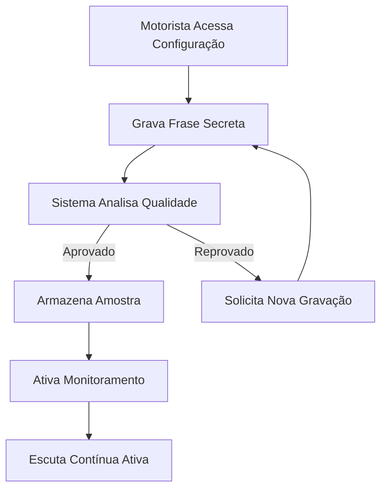
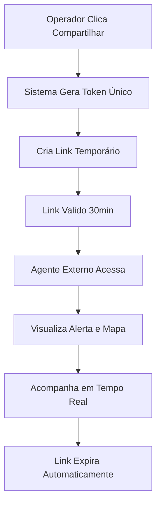

# SUSE-DF - Sistema Unificado de Segurança e Emergência

## Documento de Requisitos do Produto (PRD)

## 1. Visão Geral do Produto

O SUSE-DF é um sistema emergencial unificado que conecta motoristas de transporte por aplicativo a uma central de atendimento especializada em segurança. O sistema permite acionamento silencioso de emergências através de biometria de voz, botão de pânico e geolocalização em tempo real, garantindo resposta rápida e eficiente em situações de risco.

**Problema a resolver:** Motoristas de aplicativo enfrentam situações de risco diariamente (assaltos, sequestros, passageiros agressivos) e precisam de um sistema discreto e confiável para acionar ajuda sem chamar atenção.

**Público-alvo:** Motoristas de transporte por aplicativo, operadores de central de atendimento, supervisores de segurança e forças policiais no Distrito Federal.

**Valor do produto:** Proporciona segurança e tranquilidade aos motoristas através de tecnologia de ponta em biometria de voz, geolocalização precisa e resposta coordenada de emergência.

## 2. Funcionalidades Principais

### 2.1 Perfis de Usuário

| Perfil                | Método de Cadastro                               | Permissões Principais                                                                           |
| --------------------- | ------------------------------------------------ | ----------------------------------------------------------------------------------------------- |
| Motorista             | Cadastro via app com CPF, CNH e dados do veículo | Acionar emergência, configurar biometria de voz, definir áreas de atuação, visualizar histórico |
| Operador de Mesa      | Cadastro interno por administrador               | Visualizar e atender alertas, gerar links de compartilhamento, registrar ações                  |
| Chefe de Atendimento  | Cadastro interno por administrador               | Gerenciar operadores, visualizar dashboards, assumir ocorrências complexas                      |
| Supervisor do Sistema | Cadastro interno por administrador               | Administração completa do sistema, auditoria, configurações globais                             |
| Agente Externo        | Cadastro com token de convite                    | Acesso a alertas compartilhados via link temporário                                             |

### 2.2 Módulos de Funcionalidades

O SUSE-DF consiste nos seguintes módulos principais:

1. **Dashboard Web Central**: Interface principal para operadores com mapas em tempo real, gestão de alertas e relatórios
2. **App Mobile Motorista**: Aplicativo com botão de pânico, biometria de voz e configurações de segurança
3. **Sistema de Biometria de Voz**: IA para reconhecimento de voz e validação de identidade
4. **Gestão de Geocercas**: Sistema de cerca virtual para monitoramento de áreas de atuação
5. **Módulo de Compartilhamento**: Links temporários para compartilhamento de alertas com agentes externos
6. **Sistema de Tokens de Encerramento**: Validação segura para finalização de emergências
7. **Auditoria e Governança**: Logs completos de todas as ações do sistema
8. **Módulo de Saúde**: Gestão de dados médicos e QR Code para acesso emergencial

### 2.3 Detalhamento de Funcionalidades por Página

| Página                  | Módulo                  | Descrição das Funcionalidades                                                                                        |
| ----------------------- | ----------------------- | -------------------------------------------------------------------------------------------------------------------- |
| **Dashboard Central**   | Mapa de Alertas         | Visualização em tempo real de todos os alertas ativos com ícones coloridos por status (ativo/investigando/resolvido) |
| **Dashboard Central**   | Lista de Alertas        | Tabela com filtros por status, data, motorista e operador responsável, com ações rápidas de assumir/encerrar         |
| **Dashboard Central**   | Painel de Controle      | Estatísticas em tempo real: alertas ativos, tempo médio de resposta, taxa de resolução                               |
| **Dashboard Central**   | Geolocalização          | Atualização automática da localização do motorista a cada 5 segundos com histórico de rota                           |
| **Dashboard Central**   | Status de Conexão       | Indicadores visuais de zonas de sombra (sem sinal) e status de conectividade do dispositivo                          |
| **Dashboard Central**   | Compartilhamento        | Geração de links temporários (30 minutos) para compartilhamento de alertas com agentes externos                      |
| **Dashboard Central**   | Token de Encerramento   | Sistema de token de 8 dígitos para validação segura do encerramento de emergências                                   |
| **App Motorista**       | Botão de Pânico         | Botão discreto na tela principal que aciona alerta instantaneamente com localização precisa                          |
| **App Motorista**       | Biometria de Voz        | Configuração de frase secreta e validação contínua de identidade através de IA                                       |
| **App Motorista**       | Monitoramento por Voz   | Escuta contínua para detecção de palavras de emergência como "Socorro" ou "Me ajude"                                 |
| **App Motorista**       | Configuração de Área    | Definição de geocercas personalizadas onde o motorista opera com alertas de violação                                 |
| **App Motorista**       | Perfil de Segurança     | Gerenciamento de dados pessoais, veículo, contatos de emergência e configurações de privacidade                      |
| **App Motorista**       | Histórico               | Visualização de alertas anteriores com status, data e operador responsável                                           |
| **Configuração de Voz** | Gravação de Amostra     | Interface para gravar múltiplas amostras de voz com validação de qualidade                                           |
| **Configuração de Voz** | Teste de Reconhecimento | Validação em tempo real da precisão do reconhecimento de voz                                                         |
| **Configuração de Voz** | Sensibilidade           | Ajuste fino da sensibilidade de detecção para minimizar falsos positivos                                             |
| **Gestão de Usuários**  | Cadastro de Staff       | Interface administrativa para cadastro de operadores com hierarquia de permissões                                    |
| **Gestão de Usuários**  | Controle de Acesso      | Sistema de roles (operator/supervisor/admin) com permissões granulares                                               |
| **Auditoria**           | Logs de Ações           | Registro completo de todas as ações no sistema com filtro por usuário, data e tipo de ação                           |
| **Auditoria**           | Relatórios              | Geração de relatórios personalizados com exportação em PDF e Excel                                                   |
| **Módulo de Saúde**     | Perfil Médico           | Cadastro de informações médicas, alergias, tipo sanguíneo e contatos emergenciais                                    |
| **Módulo de Saúde**     | QR Code                 | Geração de QR Code único para acesso emergencial às informações médicas                                              |
| **Módulo de Saúde**     | Acesso Profissional     | Interface para profissionais de saúde acessarem dados via leitura de QR Code                                         |

## 3. Fluxos de Operação Principais

### 3.1 Fluxo de Emergência Completo

```mermaid
graph TD
    A[Motorista em Perigo] --> B{Escolhe Método}
    B -->|Voz| C[Diz "Socorro"]
    B -->|Botão| D[Pressiona Botão Pânico]
    
    C --> E[IA Analisa Voz]
    E -->|Verificado| F[Alerta Criado]
    E -->|Falha| F
    
    D --> F
    
    F --> G[Localização Capturada]
    G --> H[Alerta Enviado Central]
    H --> I[Operador Visualiza]
    I --> J[Operador Assume Alerta]
    J --> K[Monitoramento em Tempo Real]
    K --> L{Situação Resolvida?}
    
    L -->|Sim| M[Operador Gera Token]
    M --> N[Motorista Recebe Token]
    N --> O[Motorista Insere Token]
    O --> P[Alerta Encerrado]
    
    L -->|Não| Q[Agentes Externos Chamados]
    Q --> R[Compartilhamento via Link]
    R --> S[Polícia/Resgate Ação]
```

### 3.2 Fluxo de Configuração de Biometria



### 3.3 Fluxo de Compartilhamento Externo



## 4. Design de Interface

### 4.1 Estilo Visual

* **Cores Principais:**

  * Vermelho Alerta: `#DC2626` (emergências)

  * Verde Segurança: `#059669` (status ativo/normal)

  * Amarelo Atenção: `#D97706` (zonas de sombra)

  * Azul Sistema: `#2563EB` (interface principal)

  * Cinza Neutro: `#6B7280` (textos secundários)

* **Botões:** Estilo arredondado com sombra suave, cores que indicam ação (verde para confirmar, vermelho para emergência)

* **Tipografia:**

  * Fonte principal: Inter (sans-serif)

  * Títulos: 24-32px, peso semibold

  * Texto corpo: 16px, peso regular

  * Textos pequenos: 14px

* **Layout:** Card-based com navegação lateral fixa, responsivo para desktop first

* **Ícones:** Lucide React com consistência de estilo e tamanho

### 4.2 Elementos de Interface por Página

| Página                    | Elementos de UI                                                                                              |
| ------------------------- | ------------------------------------------------------------------------------------------------------------ |
| **Dashboard Central**     | Mapa full-screen com markers coloridos, cards de estatísticas, tabela de dados com filtros, badges de status |
| **App Motorista**         | Interface minimalista com botão de pânico central, indicador de monitoramento por voz, status de conexão     |
| **Configuração de Voz**   | Gravador de áudio visual, indicador de nível de áudio, botões de gravação/parar, feedback de validação       |
| **Token de Encerramento** | Teclado numérico grande para fácil leitura, contador de tempo, botão de emergência para caso de erro         |

### 4.3 Responsividade

* **Desktop First:** Otimizado para telas grandes (1920x1080) com informações completas

* **Mobile Adaptativo:** Layout adaptado para tablets e smartphones com navegação touch-friendly

* **PWA:** Funciona como app nativo em dispositivos móveis com instalação direta

## 5. Requisitos Técnicos

### 5.1 Performance

* Tempo de resposta para alertas: < 3 segundos

* Atualização de localização: A cada 5 segundos

* Latência de reconhecimento de voz: < 1 segundo

* Tempo de carregamento do dashboard: < 5 segundos

### 5.2 Segurança

* Autenticação via Supabase Auth com JWT

* Criptografia de dados sensíveis

* Políticas RLS (Row Level Security) no banco de dados

* Rate limiting para prevenir abuso

* Validação de tokens com expiração automática

### 5.3 Confiabilidade

* Sistema fail-open para biometria (funciona mesmo se IA falhar)

* Armazenamento offline de alertas com sincronização automática

* Backup automático de dados críticos

* Monitoramento de sa

