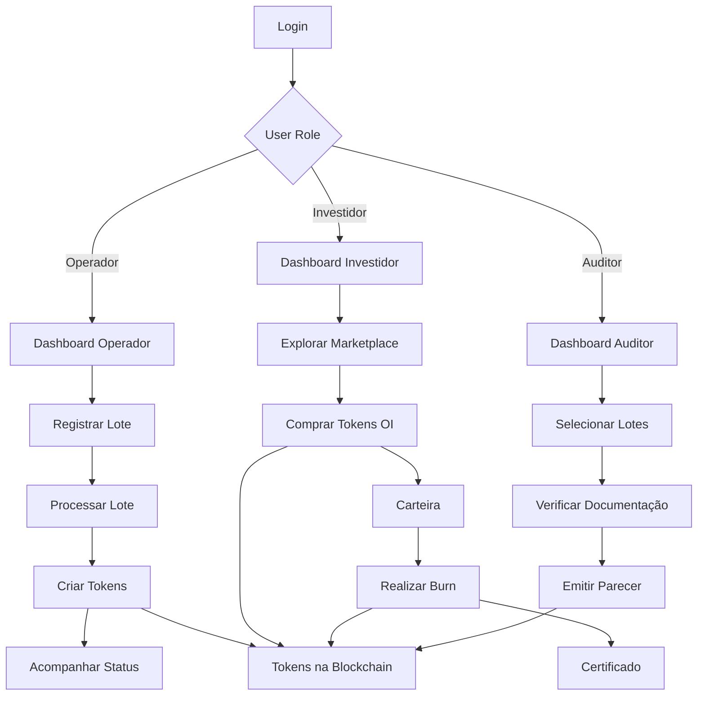

## 1. Product Overview

O Veritas Orbiun é uma infraestrutura digital que transforma resíduos em ativos ambientais tokenizados através de blockchain, garantindo rastreabilidade e transparência na economia circular. O sistema atua como camada de governança sobre processos já licenciados, mensurando impactos ambientais e criando tokens de carbono evitado.

O produto resolve o problema da falta de transparência e rastreabilidade na cadeia de reciclagem, permitindo que empresas e municípios acessem financiamentos verdes através de provas técnicas robustas de impacto ambiental.

## 2. Core Features

### 2.1 User Roles

| Role                 | Registration Method             | Core Permissions                                                |
| -------------------- | ------------------------------- | --------------------------------------------------------------- |
| Operador de Coleta   | Cadastro via empresa licenciada | Registrar lotes de resíduos, atualizar status de processamento  |
| Centro de Triagem    | Cadastro via licença ambiental  | Processar lotes, emitir tokens VL, gerar impacto ambiental      |
| Investidor/Comprador | Cadastro com KYC                | Visualizar tokens disponíveis, comprar tokens OI, realizar burn |
| Auditor Ambiental    | Convite pelo sistema            | Validar registros, realizar auditorias, emitir certificações    |
| Órgão Regulador      | Cadastro oficial                | Acessar todos os dados, verificar licenças, gerar relatórios    |

### 2.2 Feature Module

O sistema Veritas Orbiun consiste nas seguintes páginas principais:

1. **Dashboard Principal**: visualização geral dos tokens, saldo de carbono evitado, gráficos de impacto ambiental
2. **Gestão de Lotes**: registro de novos lotes, acompanhamento de processamento, cadeia de custódia
3. **Tokenização**: criação e gestão de tokens VL (Veritas Lote) e OI (Orbiun Impact)
4. **Marketplace**: compra e venda de tokens de carbono evitado, histórico de transações
5. **Burn/Retirement**: interface para aposentadoria obrigatória dos tokens utilizados
6. **Governança**: verificação de licenças, compliance regulatório, auditorias
7. **Relatórios**: geração de relatórios ESG, certificados de impacto ambiental

### 2.3 Page Details

| Page Name           | Module Name        | Feature description                                                                                                                  |
| ------------------- | ------------------ | ------------------------------------------------------------------------------------------------------------------------------------ |
| Dashboard Principal | Visão Geral        | Exibir total de carbono evitado, valor dos tokens, últimas transações e gráficos de tendência. Mostrar alertas de licenças vencidas. |
| Dashboard Principal | Carteira Digital   | Listar tokens VL e OI do usuário, valores atuais, histórico de transações com filtros por período.                                   |
| Gestão de Lotes     | Registro de Lote   | Criar novo lote com ID único, tipo de resíduo, quantidade, origem geográfica e data de coleta. Gerar QR code para rastreamento.      |
| Gestão de Lotes     | Processamento      | Atualizar status do lote (coletado, triado, processado), registrar transformações físicas, vincular fotos/documentos.                |
| Gestão de Lotes     | Cadeia de Custódia | Visualizar percurso completo do lote com timestamps, responsáveis e localizações. Exportar relatório PDF.                            |
| Tokenização         | Criar Token VL     | Converter lote processado em NFT único com metadados completos, calcular fator de impacto ambiental.                                 |
| Tokenização         | Criar Token OI     | Gerar tokens SFT representando kg de CO₂ evitado baseado na quantidade processada e fator técnico.                                   |
| Tokenização         | Validar Token      | Verificar autenticidade do token na blockchain, exibir histórico de propriedade e burns anteriores.                                  |
| Marketplace         | Listar Tokens      | Exibir tokens OI disponíveis para compra com preço, quantidade, vendedor e certificações.                                            |
| Marketplace         | Comprar Token      | Executar compra via integração com carteira Web3, transferir ownership, registrar transação na blockchain.                           |
| Marketplace         | Histórico          | Mostrar todas as transações realizadas com filtros por tipo, data e valor.                                                           |
| Burn/Retirement     | Selecionar Tokens  | Escolher tokens OI para aposentadoria, informar finalidade (compensação, lastro, etc.).                                              |
| Burn/Retirement     | Confirmar Burn     | Executar burn na blockchain, gerar certificado de aposentadoria com hash da transação.                                               |
| Burn/Retirement     | Certificados       | Listar certificados de aposentadoria emitidos, permitir download e verificação.                                                      |
| Governança          | Verificar Licenças | Consultar status de licenças ambientais das empresas, exibir validade e alertas de vencimento.                                       |
| Governança          | Auditoria          | Interface para auditores visualizarem registros selecionados para amostragem, aprovar/rejeitar.                                      |
| Governança          | Compliance         | Dashboard com indicadores de conformidade regulatória, pendências e relatórios de risco.                                             |
| Relatórios          | Impacto Ambiental  | Gerar relatórios personalizados de carbono evitado por período, tipo de resíduo e região.                                            |
| Relatórios          | Certificados ESG   | Emitir certificados de impacto ambiental para financiamentos verdes, compatíveis com LGX e ICMA.                                     |
| Relatórios          | Exportação         | Permitir exportação em PDF, Excel e formatos compatíveis com plataformas de carbono.                                                 |

## 3. Core Process

### Fluxo Principal do Usuário Operador:

1. **Login** → Dashboard com visão das atividades do dia
2. **Registrar Novo Lote** → Preencher informações do resíduo coletado → Gerar ID único e QR Code
3. **Atualizar Processamento** → Marcar etapas de triagem/processamento → Registrar quantidades e fotos
4. **Criar Tokens** → Sistema calcula impacto ambiental → Gera tokens VL (NFT) e OI (SFT)
5. **Acompanhar Status** → Visualizar tokens criados → Monitorar cadeia de custódia

### Fluxo do Investidor/Comprador:

1. **Login** → Dashboard com saldo de tokens e carteira
2. **Explorar Marketplace** → Filtrar tokens por tipo, preço, região → Analisar certificações
3. **Comprar Tokens OI** → Conectar carteira Web3 → Confirmar transação → Receber tokens na carteira
4. **Realizar Burn** → Selecionar tokens para aposentadoria → Informar finalidade → Confirmar burn → Receber certificado

### Fluxo do Auditor:

1. **Login** → Dashboard com auditorias pendentes
2. **Selecionar Lotes** → Sistema sugere amostragem baseada em risco → Auditor seleciona lotes para verificação
3. **Verificar Documentação** → Analisar fotos, documentos, localização → Validar consistência dos dados
4. **Emitir Parecer** → Aprovar ou rejeitar lote → Sistema registra decisão na blockchain

## 4. User Interface Design

### 4.1 Design Style

* **Cores Primárias**: Verde #2ECC71 (sustentabilidade), Azul #3498DB (confiança)

* **Cores Secundárias**: Branco #FFFFFF, Cinza #F5F7FA, Preto #2C3E50

* **Botões**: Estilo arredondado com gradiente suave, hover effects verde-azulado

* **Fontes**: Inter para textos, Roboto Mono para IDs e códigos

* **Layout**: Card-based com sombras sutis, navegação lateral collapsible

* **Ícones**: Estilo outline minimalista, preferencialmente Feather Icons

* **Animações**: Transições suaves de 300ms, loading skeletons

### 4.2 Page Design Overview

| Page Name           | Module Name        | UI Elements                                                                                                                            |
| ------------------- | ------------------ | -------------------------------------------------------------------------------------------------------------------------------------- |
| Dashboard Principal | Visão Geral        | Cards com métricas principais em verde/azul, gráficos de área para carbono evitado, tabela de atividades recentes com status coloridos |
| Dashboard Principal | Carteira Digital   | Grid de cards para tokens VL (com imagem do lote) e lista compacta para tokens OI com quantidade e valor                               |
| Gestão de Lotes     | Registro de Lote   | Form multi-step com validação em tempo real, mapa interativo para origem, upload drag-and-drop para documentos                         |
| Tokenização         | Criar Token        | Interface wizard com preview do token, cálculo automático do impacto ambiental, confirmação via metamask                               |
| Marketplace         | Listar Tokens      | Grid responsivo de cards de tokens OI, filtros laterais collapsible, ordenação por preço/quantidade                                    |
| Burn/Retirement     | Selecionar Tokens  | Interface similar a carrinho de compras, mostrar quantidade disponível vs selecionada, preview do certificado                          |
| Governança          | Verificar Licenças | Tabela com status colorido (verde válido, vermelho vencido), busca e filtros por empresa/tipo                                          |
| Relatórios          | Impacto Ambiental  | Gerador de relatórios com seleção de período via datepicker, preview em tempo real, download em PDF/Excel                              |

### 4.3 Responsiveness

* **Desktop-first**: Otimizado para telas 1440px e acima

* **Mobile-adaptive**: Layout adaptável para tablets (768px) e smartphones (375px)

* **Touch optimization**: Botões com área de toque mínima de 44px, gestos de swipe para navegação em mobile

* **Breakpoints**: 320px, 768px, 1024px, 1440px, 1920px

### 4.4 Blockchain Integration UI

* **Wallet Connection**: Botão prominente "Conectar Carteira" com logos das principais wallets (MetaMask, WalletConnect)

* **Transaction Status**: Toast notifications para transações pendentes/confirmadas com links para blockchain explorer

* **Gas Fees**: Preview de taxas antes de confirmação, opção de velocidade de transação (lenta/média/rápida)

* **Network Indicator**: Badge mostrando rede conectada (Ethereum, Polygon) com status de conexão

