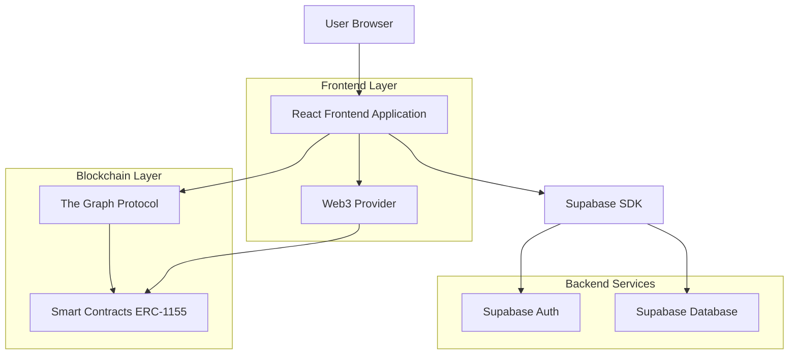
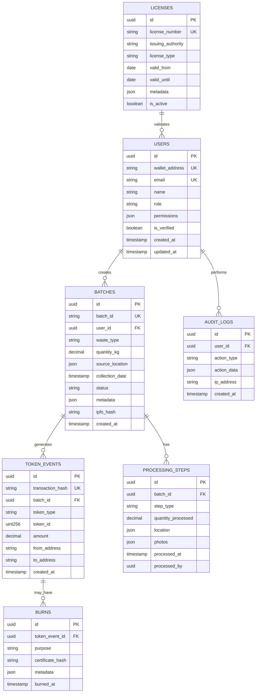

## 1. Architecture design



## 2. Technology Description

- Frontend: React@18 + tailwindcss@3 + vite + ethers@6 + wagmi@2
- Initialization Tool: vite-init
- Backend: Supabase (PostgreSQL + Auth + Storage)
- Blockchain: Ethereum/Polygon with ERC-1155 smart contracts
- Indexing: The Graph Protocol para queries blockchain otimizadas
- File Storage: IPFS via Pinata para metadados dos tokens

## 3. Route definitions

| Route | Purpose |
|-------|---------|
| / | Dashboard principal com métricas e visão geral |
| /auth/login | Login com Web3 ou credenciais tradicionais |
| /dashboard | Dashboard personalizado por tipo de usuário |
| /lotes | Gestão de lotes de resíduos |
| /lotes/novo | Criação de novo lote |
| /lotes/:id | Detalhes do lote e cadeia de custódia |
| /tokenizacao | Interface de tokenização de lotes |
| /marketplace | Compra e venda de tokens OI |
| /carteira | Visualização da carteira de tokens |
| /burn | Interface para aposentadoria de tokens |
| /governanca | Verificação de licenças e auditoria |
| /relatorios | Geração de relatórios ESG |
| /perfil | Configurações do usuário |

## 4. Smart Contract Definitions

### 4.1 VeritasOrbiunToken (ERC-1155)

```solidity
contract VeritasOrbiunToken is ERC1155, AccessControl {
    bytes32 public constant MINTER_ROLE = keccak256("MINTER_ROLE");
    bytes32 public constant BURNER_ROLE = keccak256("BURNER_ROLE");
    
    // Token IDs
    uint256 public constant VL_TOKEN = 1; // Veritas Lote (NFT)
    uint256 public constant OI_TOKEN = 2; // Orbiun Impact (SFT)
    
    struct TokenMetadata {
        string batchId;
        uint256 amountProcessed;
        uint256 carbonAvoided;
        string wasteType;
        string processingLocation;
        uint256 timestamp;
        bool isBurned;
        string ipfsHash;
    }
    
    mapping(uint256 => TokenMetadata) public tokenMetadata;
    mapping(string => bool) public batchIdExists;
}
```

### 4.2 Core Functions

**mintVLToken**
```solidity
function mintVLToken(
    address to,
    string memory batchId,
    uint256 amountProcessed,
    string memory wasteType,
    string memory processingLocation,
    string memory ipfsHash
) external onlyRole(MINTER_ROLE) returns (uint256)
```

**mintOIToken**
```solidity
function mintOIToken(
    address to,
    string memory batchId,
    uint256 carbonAvoided,
    uint256 amount
) external onlyRole(MINTER_ROLE) returns (uint256)
```

**burnToken**
```solidity
function burnToken(
    address from,
    uint256 tokenId,
    uint256 amount,
    string memory purpose
) external onlyRole(BURNER_ROLE)
```

## 5. API Definitions

### 5.1 Authentication APIs

**Web3 Login**
```
POST /api/auth/web3-login
```

Request:
| Param Name | Param Type | isRequired | Description |
|------------|------------|------------|-------------|
| address | string | true | Ethereum wallet address |
| signature | string | true | Signed message from wallet |
| message | string | true | Original message signed |

Response:
| Param Name | Param Type | Description |
|------------|------------|-------------|
| token | string | JWT token for authentication |
| user | object | User data and permissions |

### 5.2 Batch Management APIs

**Create Batch**
```
POST /api/batches
```

Request:
| Param Name | Param Type | isRequired | Description |
|------------|------------|------------|-------------|
| wasteType | string | true | Type of waste (glass, plastic, etc.) |
| quantity | number | true | Quantity in kg |
| sourceLocation | object | true | GPS coordinates and address |
| collectionDate | string | true | ISO date string |
| operatorId | string | true | ID of collecting operator |

**Update Batch Status**
```
PUT /api/batches/:id/status
```

Request:
| Param Name | Param Type | isRequired | Description |
|------------|------------|------------|-------------|
| status | string | true | New status (collected, sorted, processed) |
| location | object | false | Current location GPS |
| photos | array | false | Array of photo URLs |
| notes | string | false | Additional notes |

### 5.3 Token APIs

**Tokenize Batch**
```
POST /api/tokens/tokenize
```

Request:
| Param Name | Param Type | isRequired | Description |
|------------|------------|------------|-------------|
| batchId | string | true | Batch ID to tokenize |
| carbonFactor | number | true | Carbon avoidance factor |
| processingProof | object | true | Processing evidence |

**Get User Tokens**
```
GET /api/tokens/user/:address
```

Response:
| Param Name | Param Type | Description |
|------------|------------|-------------|
| vlTokens | array | Array of VL NFTs owned |
| oiTokens | array | Array of OI SFTs owned |
| totalCarbonAvoided | number | Total carbon avoided in kg |

## 6. Data Model

### 6.1 Database Schema



### 6.2 Data Definition Language

**Users Table**
```sql
CREATE TABLE users (
    id UUID PRIMARY KEY DEFAULT gen_random_uuid(),
    wallet_address VARCHAR(42) UNIQUE,
    email VARCHAR(255) UNIQUE,
    name VARCHAR(255) NOT NULL,
    role VARCHAR(50) NOT NULL CHECK (role IN ('operator', 'investor', 'auditor', 'regulator')),
    permissions JSONB DEFAULT '{}',
    is_verified BOOLEAN DEFAULT false,
    created_at TIMESTAMP WITH TIME ZONE DEFAULT NOW(),
    updated_at TIMESTAMP WITH TIME ZONE DEFAULT NOW()
);

CREATE INDEX idx_users_wallet ON users(wallet_address);
CREATE INDEX idx_users_role ON users(role);
```

**Batches Table**
```sql
CREATE TABLE batches (
    id UUID PRIMARY KEY DEFAULT gen_random_uuid(),
    batch_id VARCHAR(100) UNIQUE NOT NULL,
    user_id UUID REFERENCES users(id),
    waste_type VARCHAR(100) NOT NULL,
    quantity_kg DECIMAL(10,2) NOT NULL CHECK (quantity_kg > 0),
    source_location JSONB NOT NULL,
    collection_date TIMESTAMP WITH TIME ZONE NOT NULL,
    status VARCHAR(50) NOT NULL DEFAULT 'collected' CHECK (status IN ('collected', 'sorted', 'processed', 'tokenized')),
    metadata JSONB DEFAULT '{}',
    ipfs_hash VARCHAR(100),
    created_at TIMESTAMP WITH TIME ZONE DEFAULT NOW(),
    updated_at TIMESTAMP WITH TIME ZONE DEFAULT NOW()
);

CREATE INDEX idx_batches_batch_id ON batches(batch_id);
CREATE INDEX idx_batches_user_id ON batches(user_id);
CREATE INDEX idx_batches_status ON batches(status);
CREATE INDEX idx_batches_waste_type ON batches(waste_type);
```

**Token Events Table**
```sql
CREATE TABLE token_events (
    id UUID PRIMARY KEY DEFAULT gen_random_uuid(),
    transaction_hash VARCHAR(66) UNIQUE NOT NULL,
    batch_id UUID REFERENCES batches(id),
    token_type VARCHAR(10) NOT NULL CHECK (token_type IN ('VL', 'OI')),
    token_id DECIMAL(78,0) NOT NULL,
    amount DECIMAL(78,0) NOT NULL,
    from_address VARCHAR(42),
    to_address VARCHAR(42) NOT NULL,
    created_at TIMESTAMP WITH TIME ZONE DEFAULT NOW()
);

CREATE INDEX idx_token_events_tx_hash ON token_events(transaction_hash);
CREATE INDEX idx_token_events_batch_id ON token_events(batch_id);
CREATE INDEX idx_token_events_token_type ON token_events(token_type);
```

### 6.3 Row Level Security (RLS) Policies

**Batches Table Policies**
```sql
-- Enable RLS
ALTER TABLE batches ENABLE ROW LEVEL SECURITY;

-- Users can only see their own batches (unless auditor/regulator)
CREATE POLICY users_view_own_batches ON batches FOR SELECT
    USING (
        auth.uid() = user_id OR 
        EXISTS (
            SELECT 1 FROM users 
            WHERE id = auth.uid() 
            AND role IN ('auditor', 'regulator')
        )
    );

-- Only authenticated users can create batches
CREATE POLICY authenticated_create_batches ON batches FOR INSERT
    WITH CHECK (auth.uid() = user_id);

-- Users can update only their own batches
CREATE POLICY users_update_own_batches ON batches FOR UPDATE
    USING (auth.uid() = user_id);
```

## 7. Blockchain Integration Architecture

### 7.1 Event Indexing with The Graph

```yaml
specVersion: 0.0.4
schema:
  file: ./schema.graphql
dataSources:
  - kind: ethereum
    name: VeritasOrbiunToken
    network: polygon
    source:
      address: "0x..."
      abi: VeritasOrbiunToken
      startBlock: 12345678
    mapping:
      kind: ethereum/events
      apiVersion: 0.0.6
      language: wasm/assemblyscript
      entities:
        - TokenMinted
        - TokenBurned
        - Transfer
      abis:
        - name: VeritasOrbiunToken
          file: ./abis/VeritasOrbiunToken.json
      eventHandlers:
        - event: TokenMinted(indexed address,indexed uint256,uint256)
          handler: handleTokenMinted
        - event: TokenBurned(indexed address,indexed uint256,uint256,string)
          handler: handleTokenBurned
        - event: TransferSingle(indexed address,indexed address,indexed address,uint256,uint256)
          handler: handleTransferSingle
      file: ./src/mapping.ts
```

### 7.2 IPFS Metadata Structure

```json
{
  "name": "Veritas Lote #VL001",
  "description": "Token representing waste batch processing",
  "image": "ipfs://QmXxXxXxXxXxXxXxXxXxXxXxXxXxXxXxXxXxXxXxXxXx",
  "attributes": [
    {
      "trait_type": "Batch ID",
      "value": "BATCH_001_20260127"
    },
    {
      "trait_type": "Waste Type",
      "value": "Glass"
    },
    {
      "trait_type": "Amount Processed",
      "value": "1000",
      "unit": "kg"
    },
    {
      "trait_type": "Processing Location",
      "value": "São Paulo, SP"
    },
    {
      "trait_type": "Carbon Avoided",
      "value": "400",
      "unit": "kg CO2"
    },
    {
      "trait_type": "Processing Date",
      "value": "2026-01-27"
    }
  ],
  "properties": {
    "batch_metadata": "ipfs://QmYyYyYyYyYyYyYyYyYyYyYyYyYyYyYyYyYyYyYyYyYy",
    "processing_photos": [
      "ipfs://QmZzZzZzZzZzZzZzZzZzZzZzZzZzZzZzZzZzZzZzZzZzZz",
      "ipfs://QmAaAaAaAaAaAaAaAaAaAaAaAaAaAaAaAaAaAaAaAaAa"
    ],
    "certifications": [
      {
        "type": "Environmental License",
        "issuer": "CETESB",
        "valid_until": "2026-12-31"
      }
    ]
  }
}
```

## 8. Security Considerations

### 8.1 Smart Contract Security

- **Access Control**: Implementação de roles baseadas em OpenZeppelin
- **Reentrancy Guards**: Proteção contra ataques de reentrância
- **Integer Overflow**: Uso de SafeMath para operações aritméticas
- **Oracle Integration**: Chainlink para dados externos quando necessário
- **Upgradeability**: Pattern proxy para atualizações contratuais

### 8.2 Frontend Security

- **Content Security Policy**: Restrição de scripts e recursos externos
- **Input Validation**: Validação rigorosa de todos os inputs
- **Rate Limiting**: Limitação de requisições por IP/usuário
- **HTTPS Enforcement**: Toda comunicação via HTTPS
- **Wallet Security**: Verificação de assinaturas e validação de endereços

### 8.3 Data Privacy

- **Encryption**: Dados sensíveis criptografados em repouso
- **PII Protection**: Informações pessoais segregadas e protegidas
- **Audit Logs**: Registro completo de todas as operações
- **GDPR Compliance**: Direito ao esquecimento implementado via soft delete