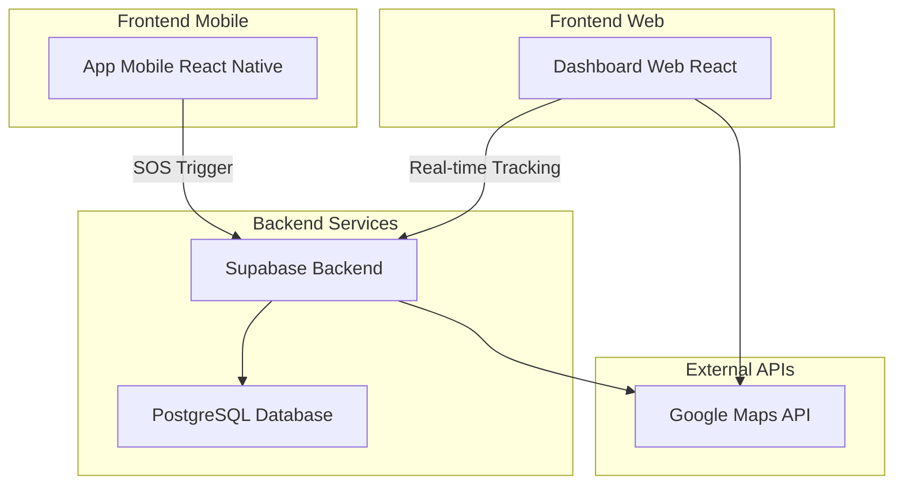
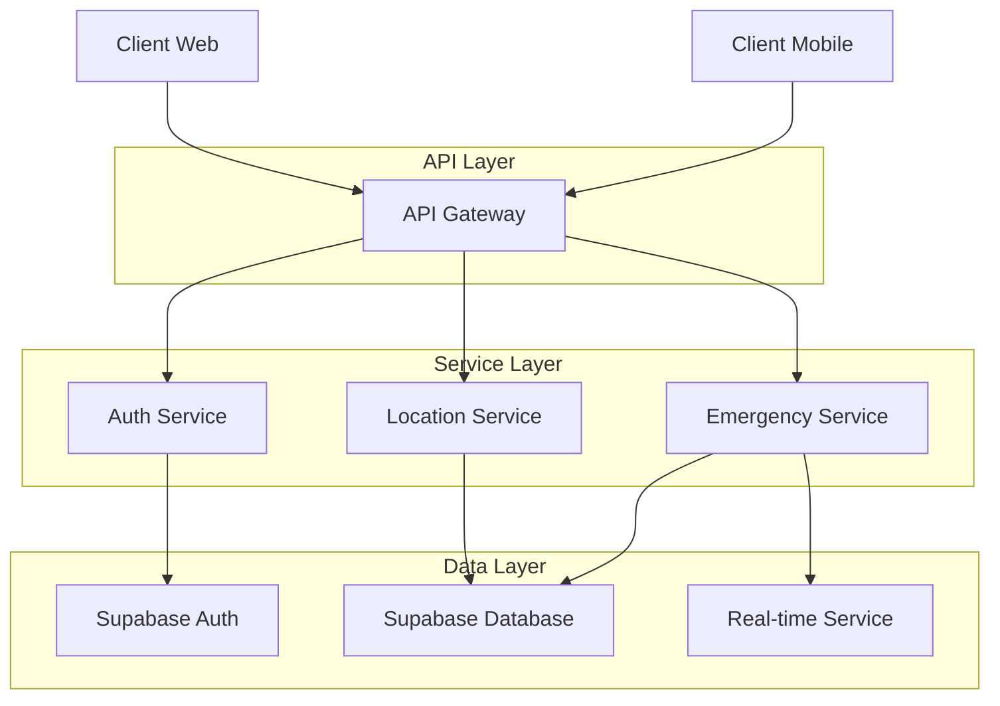
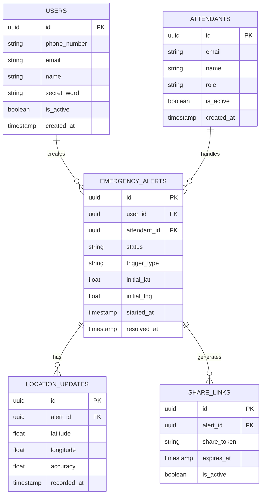

## 1. Architecture design



## 2. Technology Description
- **Frontend Mobile**: React Native@0.72 + Native Modules
- **Frontend Web**: React@18 + tailwindcss@3 + vite
- **Initialization Tool**: vite-init (web), react-native-cli (mobile)
- **Backend**: Supabase (PostgreSQL, Real-time Subscriptions, Authentication)
- **Maps Integration**: Google Maps SDK + Google Maps JavaScript API

## 3. Route definitions

### Mobile App Routes
| Route | Purpose |
|-------|---------|
| /home | Tela principal com botão de pânico e status |
| /emergency | Tela de emergência ativa com confirmações |
| /settings | Configurações de palavra secreta e contatos |

### Web Dashboard Routes
| Route | Purpose |
|-------|---------|
| /login | Login do atendente |
| /dashboard | Dashboard principal com lista de alertas |
| /tracking/:id | Tela de rastreamento com Google Maps |
| /admin | Painel administrativo (se aplicável) |

## 4. API definitions

### 4.1 Emergency Alert API
```
POST /api/emergency/trigger
```

Request:
| Param Name| Param Type  | isRequired  | Description |
|-----------|-------------|-------------|-------------|
| user_id   | string      | true        | ID do usuário |
| location  | object      | true        | {lat: number, lng: number} |
| trigger_type | string   | true        | 'voice' ou 'button' |
| secret_word | string    | false       | Palavra secreta (se trigger_type = voice) |

Response:
| Param Name| Param Type  | Description |
|-----------|-------------|-------------|
| alert_id  | string      | ID único do alerta |
| status    | string      | Status do alerta ('active', 'resolved') |
| created_at| timestamp   | Horário do alerta |

### 4.2 Location Update API
```
POST /api/location/update
```

Request:
| Param Name| Param Type  | isRequired  | Description |
|-----------|-------------|-------------|-------------|
| alert_id  | string      | true        | ID do alerta |
| location  | object      | true        | {lat: number, lng: number} |
| timestamp | timestamp | true        | Horário da localização |

### 4.3 Share Link API
```
POST /api/share/create
```

Request:
| Param Name| Param Type  | isRequired  | Description |
|-----------|-------------|-------------|-------------|
| alert_id  | string      | true        | ID do alerta |
| expires_in| number      | false       | Tempo de expiração em minutos (default: 60) |

Response:
| Param Name| Param Type  | Description |
|-----------|-------------|-------------|
| share_url | string      | URL pública de compartilhamento |
| expires_at| timestamp   | Data de expiração do link |

## 5. Server architecture diagram



## 6. Data model

### 6.1 Data model definition


### 6.2 Data Definition Language

**Users Table**
```sql
CREATE TABLE users (
  id UUID PRIMARY KEY DEFAULT gen_random_uuid(),
  phone_number VARCHAR(20) UNIQUE NOT NULL,
  email VARCHAR(255) UNIQUE,
  name VARCHAR(100) NOT NULL,
  secret_word VARCHAR(50) NOT NULL,
  is_active BOOLEAN DEFAULT true,
  created_at TIMESTAMP WITH TIME ZONE DEFAULT NOW(),
  updated_at TIMESTAMP WITH TIME ZONE DEFAULT NOW()
);

-- Indexes
CREATE INDEX idx_users_phone ON users(phone_number);
CREATE INDEX idx_users_active ON users(is_active);
```

**Attendants Table**
```sql
CREATE TABLE attendants (
  id UUID PRIMARY KEY DEFAULT gen_random_uuid(),
  email VARCHAR(255) UNIQUE NOT NULL,
  name VARCHAR(100) NOT NULL,
  role VARCHAR(50) DEFAULT 'attendant',
  is_active BOOLEAN DEFAULT true,
  created_at TIMESTAMP WITH TIME ZONE DEFAULT NOW()
);

-- Indexes
CREATE INDEX idx_attendants_email ON attendants(email);
```

**Emergency Alerts Table**
```sql
CREATE TABLE emergency_alerts (
  id UUID PRIMARY KEY DEFAULT gen_random_uuid(),
  user_id UUID REFERENCES users(id),
  attendant_id UUID REFERENCES attendants(id),
  status VARCHAR(20) DEFAULT 'active' CHECK (status IN ('active', 'resolved', 'cancelled')),
  trigger_type VARCHAR(20) CHECK (trigger_type IN ('voice', 'button')),
  initial_lat DECIMAL(10, 8) NOT NULL,
  initial_lng DECIMAL(11, 8) NOT NULL,
  started_at TIMESTAMP WITH TIME ZONE DEFAULT NOW(),
  resolved_at TIMESTAMP WITH TIME ZONE,
  created_at TIMESTAMP WITH TIME ZONE DEFAULT NOW()
);

-- Indexes
CREATE INDEX idx_alerts_status ON emergency_alerts(status);
CREATE INDEX idx_alerts_user ON emergency_alerts(user_id);
CREATE INDEX idx_alerts_started ON emergency_alerts(started_at DESC);
```

**Location Updates Table**
```sql
CREATE TABLE location_updates (
  id UUID PRIMARY KEY DEFAULT gen_random_uuid(),
  alert_id UUID REFERENCES emergency_alerts(id),
  latitude DECIMAL(10, 8) NOT NULL,
  longitude DECIMAL(11, 8) NOT NULL,
  accuracy FLOAT,
  recorded_at TIMESTAMP WITH TIME ZONE DEFAULT NOW()
);

-- Indexes
CREATE INDEX idx_locations_alert ON location_updates(alert_id);
CREATE INDEX idx_locations_recorded ON location_updates(recorded_at DESC);
```

**Share Links Table**
```sql
CREATE TABLE share_links (
  id UUID PRIMARY KEY DEFAULT gen_random_uuid(),
  alert_id UUID REFERENCES emergency_alerts(id),
  share_token VARCHAR(64) UNIQUE NOT NULL,
  expires_at TIMESTAMP WITH TIME ZONE NOT NULL,
  is_active BOOLEAN DEFAULT true,
  created_at TIMESTAMP WITH TIME ZONE DEFAULT NOW()
);

-- Indexes
CREATE INDEX idx_shares_token ON share_links(share_token);
CREATE INDEX idx_shares_expires ON share_links(expires_at);
```

-- Supabase Row Level Security Policies
```sql
-- Enable RLS
ALTER TABLE emergency_alerts ENABLE ROW LEVEL SECURITY;
ALTER TABLE location_updates ENABLE ROW LEVEL SECURITY;
ALTER TABLE share_links ENABLE ROW LEVEL SECURITY;

-- Grant permissions
GRANT SELECT ON emergency_alerts TO anon;
GRANT ALL PRIVILEGES ON emergency_alerts TO authenticated;
GRANT SELECT ON location_updates TO anon;
GRANT ALL PRIVILEGES ON location_updates TO authenticated;
GRANT SELECT ON share_links TO anon;
GRANT ALL PRIVILEGES ON share_links TO authenticated;
```
