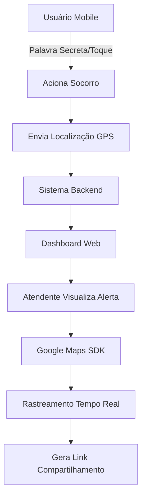

# 1. Product Overview
Sistema de socorro emergencial que conecta usuários em perigo com equipes de atendimento através de palavra secreta de emergência. O usuário aciona o socorro via app mobile e os atendentes visualizam a localização em tempo real através do dashboard web com Google Maps SDK.

- Resolve o problema de pedidos de ajuda discretos em situações de risco
- Público-alvo: Pessoas em situações vulneráveis e equipes de segurança/atendimento
- Valor de mercado: Segurança pessoal e resposta emergencial em tempo real

## 2. Core Features

### 2.1 User Roles
| Role | Registration Method | Core Permissions |
|------|---------------------|------------------|
| Usuário Mobile | Cadastro via app com email/telefone | Acionar socorro, visualizar status de emergência |
| Atendente Web | Cadastro administrativo via dashboard | Visualizar alertas, rastrear localização, gerar links de compartilhamento |
| Administrador | Cadastro interno | Gerenciar usuários, configurar sistema, visualizar relatórios |

### 2.2 Feature Module
Nosso sistema de socorro consiste nas seguintes páginas principais:

**Aplicativo Mobile (Usuário):**
1. **Tela Principal**: Botão de pânico discreto, status de segurança, configuração de palavra secreta
2. **Tela de Emergência Ativa**: Confirmação de socorro enviado, tempo de resposta, instruções de segurança

**Dashboard Web (Atendente):**
3. **Dashboard Principal**: Lista de alertas ativos, mapa com localizações, painel de controle
4. **Tela de Rastreamento**: Visualização em tempo real no Google Maps, histórico de movimentação, controles de zoom e foco

### 2.3 Page Details
| Page Name | Module Name | Feature description |
|-----------|-------------|---------------------|
| Tela Principal Mobile | Botão de Pânico | Acionar socorro através de palavra secreta ou toque longo, enviar localização e dados do usuário |
| Tela Principal Mobile | Configurações de Segurança | Definir palavra secreta, configurar contatos de emergência, ativar modo discreto |
| Emergência Ativa Mobile | Status de Socorro | Mostrar confirmação de envio, tempo estimado de resposta, orientações de segurança |
| Dashboard Principal Web | Alertas de Emergência | Listar chamados ativos com prioridade, mostrar dados do usuário, horário do alerta |
| Dashboard Principal Web | Mapa de Ocorrências | Exibir pins no mapa com localização dos usuários, diferenciar por status de atendimento |
| Tela de Rastreamento Web | Google Maps SDK | Mostrar localização em tempo real, traçar rota de movimentação, atualizar posição automaticamente |
| Tela de Rastreamento Web | Compartilhamento | Gerar link público com tempo de expiração, controlar acesso externo à localização |

## 3. Core Process
**Fluxo do Usuário Mobile:**
O usuário configura uma palavra secreta no app. Em situação de emergência, fala a palavra secreta ou mantém o botão pressionado. O app captura a localização GPS e envia o alerta para o sistema. O usuário recebe confirmação visual e sonora do envio bem-sucedido.

**Fluxo do Atendente Web:**
O atendente visualiza novos alertas no dashboard. Clica no alerta para ver detalhes e localização no mapa. Acompanha o movimento do usuário em tempo real. Gera link de compartilhamento para equipes externas quando necessário. Finaliza o atendimento quando a situação é resolvida.

## 4. User Interface Design

### 4.1 Design Style
- **Cores Primárias**: Vermelho emergencial (#DC2626) para alertas, Verde segurança (#059669) para status normal
- **Cores Secundárias**: Cinza escuro (#374151) para texto, Branco (#FFFFFF) para fundos
- **Botões**: Estilo arredondado com sombra suave, tamanhos grandes para fácil acesso em emergência
- **Fontes**: Roboto Bold para títulos (18-24px), Roboto Regular para texto (14-16px)
- **Layout**: Mobile-first com cards empilhados, Dashboard com grid responsivo
- **Ícones**: Material Design Icons, ícones de emergência e localização em destaque

### 4.2 Page Design Overview
| Page Name | Module Name | UI Elements |
|-----------|-------------|-------------|
| Tela Principal Mobile | Botão de Pânico | Botão circular grande (80px) vermelho com ícone de alerta, posicionado na parte inferior central para acesso fácil com uma mão |
| Tela Principal Mobile | Status de Segurança | Card superior com fundo verde/claro mostrando "Seguro" ou vermelho para "Emergência Ativa", com ícone de escudo |
| Dashboard Web | Alertas | Tabela com linhas destacadas em vermelho para alertas não atendidos, mostrando nome, horário e distância do usuário |
| Dashboard Web | Mapa | Mapa ocupando 70% da tela com pins coloridos, painel lateral com lista de ocorrências, controles de zoom no canto superior direito |
| Tela Rastreamento | Google Maps | Mapa em tela cheia com trajetória em linha vermelha, card flutuante com dados do usuário e botão de compartilhamento |

### 4.3 Responsiveness
Mobile-first para o app do usuário com otimização para uso com uma mão. Dashboard web responsivo com breakpoint em 768px, mantendo funcionalidade completa em tablets. Suporte a touch em todos os elementos interativos do mobile, com áreas de toque mínimas de 44x44px conforme guidelines de acessibilidade.
